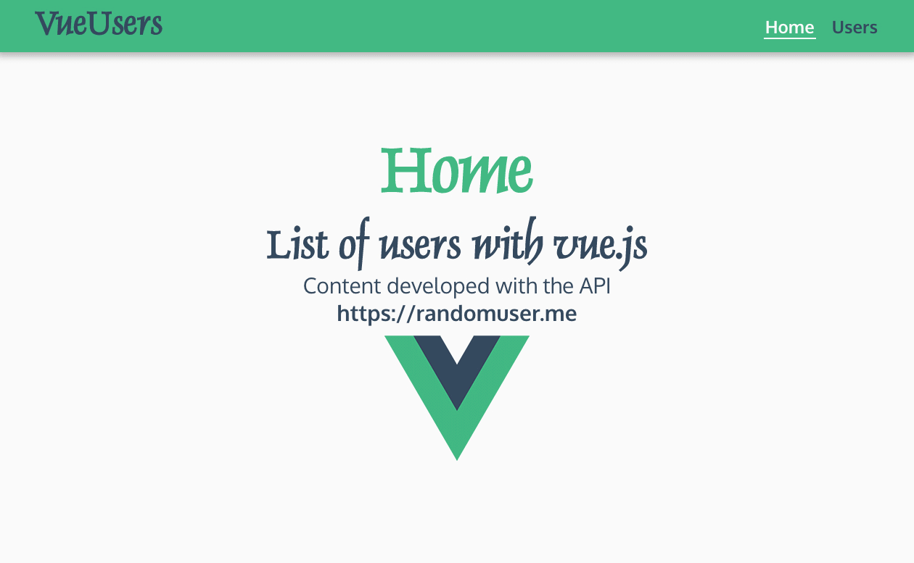

  


# Vue Users



## 🎯 Description

Vue Users is an application that obtains a list of random users from an API and print the information.

It has 3 views: the home, the user list and the user detail. There are several buttons with different actions to delete, hide and select random users. By clicking on a user you can see the complete information of the selected user, this page has a map made with Google Maps or Leaflet.

## 🏗️ Developed with

Is developed with **[Vue 2](https://vuejs.org/)** a Javascript framework, use [Vue Cli](https://cli.vuejs.org/) and has dependencies as [Vue Router](https://router.vuejs.org/), [Vue Leaflet](https://vue2-leaflet.netlify.app/) and [Google Maps](https://www.npmjs.com/package/@googlemaps/js-api-loader).

For information on how to configure the Google Maps API, see the dedicated [Google Maps setup guide](./README.google-maps.md).

## 🚀 Commands

### Install dependencies

Install all dependencies listed in `package.json`.

```bash
npm install
```

### Clean install dependencies

Remove `node_modules` and `package-lock.json` to reinstall from scratch.

```bash
npm run install:clean
```

### Lint after install

Runs automatically after `npm install` to run `npm run lint` on all project files.

```bash
npm run postinstall
```

### Set up Husky git hooks

Runs automatically after `postinstall` to enable `pre-commit` and `commit-msg` hooks of [Husky](https://typicode.github.io/husky/).

```bash
npm run prepare
```

### Create file for enviroment variables for development

Create `.env.local` file from `.env.local.sample` for local development.

```bash
npm run env:create
```

### Compiles and hot-reloads for development

Launch the development server on `localhost` with hot reload.

```bash
npm run serve
```

### Compiles and minifies for production

Build and minify the project for production.

```bash
npm run build
```

### Lints and fixes files

```bash
npm run lint
```

### Format files with Prettier

Format CSS, SCSS, JSON, YAML, JS and Vue files with [Prettier](https://prettier.io/).

```bash
npm run prettier:fix
```

### Lint and fix styles with Stylelint

Lint and fix CSS, SCSS and Vue files with [Stylelint](https://stylelint.io/).

```bash
npm run stylelint:fix
```

### Lint and fix files with ESLint

Lint and fix JSON, JS and Vue files with [ESLint](https://eslint.org/).

```bash
npm run eslint:fix
```

### Publish in Github Pages

```bash
npm run deploy
```

## 📄 License

This project is licensed under the `MIT` License, which allows free use, modification and distribution. See [LICENSE](LICENSE) for details.
